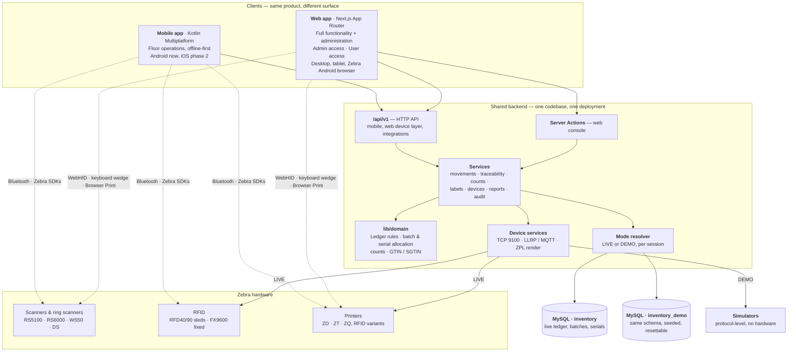
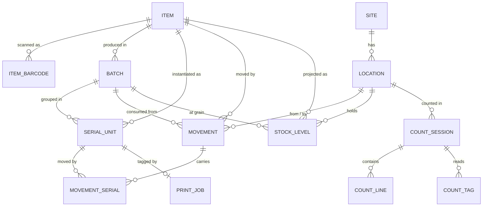
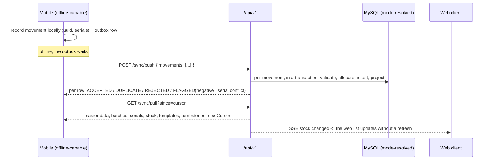

# Inventory App — Architecture

> One inventory product, one database, one backend, two clients.
> The **web app** is the complete application: every inventory function, full traceability, and administration.
> The **mobile app** (`inventory-mobile-app`, Kotlin Multiplatform) is the same product on the warehouse floor.
> Both connect to Zebra hardware, and both run in **Live mode or Demo mode**.
>
> Plan: [PROJECT_PLAN.md](PROJECT_PLAN.md) · API: [API_CONTRACT.md](API_CONTRACT.md) ·
> Hardware: [DEVICE_INTEGRATION.md](DEVICE_INTEGRATION.md) · Demo: [DEMO_MODE.md](DEMO_MODE.md)
> Last updated: 2026-09-17.

---

## 0. The shape of the system



Four consequences, and everything else in this document follows from them:

1. **Feature parity is the default.** Anything the mobile app can do, the web app can do. The web app
   additionally owns administration, traceability reporting, bulk work and approvals. A feature is built once in
   the domain and services layer and surfaced on both clients.
2. **One set of rules.** `lib/domain` is the single implementation of "is this movement valid, and which batch
   or serial does it consume?" It is a port of the mobile app's Kotlin `:core:domain`, extended for
   traceability, and the Kotlin unit tests are its starting specification.
3. **Both clients talk to Zebra hardware**, by different routes but through the same abstraction (§7).
4. **Every code path runs identically in Demo mode** (§8). Demo mode swaps the _database_ and the _devices_,
   never the logic — which is what makes a demo evidence of the real system rather than a mock-up of it.

### Where the mobile app stands today

It is a **UI-only MVP on in-memory mock data** (its ADR-010) with simulated devices. Its screens, domain rules
and device layer are real and unit-tested; its repositories are fake and reset on restart. Its roadmap
(`MVP_PLAN.md` §11) lists what it needs: backend, auth, local database, sync engine, real device adapters. This
project delivers the backend and database; the mobile repo swaps its mock repositories for real ones behind the
interfaces it already has, and later adopts the same Live/Demo mode switch (§8.5).

---

## 1. Principles

1. **One ledger, one truth.** Stock is never written directly. Every change is an append-only `movements` row;
   `stock_levels`, `batches` balances and `serial_units` locations are projections rebuildable from the ledger.
   Carried over from the mobile app's ADR-005.
2. **Traceability is not an add-on.** Batch, serial and expiry are part of the ledger's grain from the first
   migration. Retrofitting them onto a live ledger is the migration nobody survives cleanly.
3. **Track only what needs tracking.** Every item declares its own `tracking_mode`: `NONE`, `BATCH` or
   `SERIAL`. Packing tape is `NONE`; a batch of adhesive with a shelf life is `BATCH`; a power tool is `SERIAL`.
   One model, three behaviours, chosen per item.
4. **Build in the domain, surface in the clients.** New behaviour goes into `lib/domain` and a service, then
   gets a web screen and an API endpoint. Never into a screen directly.
5. **Client-generated IDs.** Movement primary keys are UUIDs minted by whichever client created them, as the
   mobile app already does. Every write is idempotent: a retry is a duplicate-key no-op.
6. **Hardware-agnostic device layer.** Neither client talks to a specific scanner. Both talk to
   `BarcodeScanner`, `RfidReader` and `LabelPrinter` abstractions with interchangeable implementations.
7. **Degrade, don't break.** The web device layer has a universal fallback (HID keyboard wedge) needing no
   installation. Richer transports are progressive enhancement, never a requirement.
8. **Online validates, offline reconciles.** Online writes are validated and rejected on failure; writes queued
   offline are accepted and flagged for review. The split is online/offline, not web/mobile.
9. **Demo mode shares the code, not the data.** Same application, same API, same transactions — a different
   database and simulated devices.
10. **Reversible by default.** Nothing is hard-deleted. Master data is soft-deleted, ledger rows are never
    deleted, corrections are new compensating movements.

---

## 2. Technology

Aligned with the team's existing Next.js production app (`madenkorea-production`).

| Concern            | Choice                                                                                        | Note                                                                                                    |
| ------------------ | --------------------------------------------------------------------------------------------- | ------------------------------------------------------------------------------------------------------- |
| Framework          | **Next.js, App Router** (pin at kickoff)                                                      | `madenkorea-production` runs 14.2.35; match it if code reuse matters                                    |
| Language           | TypeScript, `strict: true`                                                                    |                                                                                                         |
| Database           | **MySQL 8.0+**, InnoDB, `utf8mb4`                                                             | Two databases: `inventory` and `inventory_demo`, identical schema (§8)                                  |
| ORM                | **Prisma** (`provider = "mysql"`)                                                             | Two clients, one per mode, resolved per request. Raw SQL for the projection upsert and number sequences |
| Web auth           | **NextAuth (Auth.js)**, credentials + session cookie                                          | Admin / User tiers (§6); the session carries the mode                                                   |
| Mobile auth        | **JWT access + refresh** from `/api/v1/auth/token`                                            | Device-bound; the token carries the mode                                                                |
| Validation         | **Zod**, shared by Server Actions and API routes                                              |                                                                                                         |
| UI                 | Tailwind + shadcn/ui (Radix), lucide icons                                                    |                                                                                                         |
| Forms              | react-hook-form + `@hookform/resolvers/zod`                                                   |                                                                                                         |
| Tables             | TanStack Table, server-side paging and filtering                                              |                                                                                                         |
| Charts             | Recharts                                                                                      |                                                                                                         |
| Exports            | exceljs (XLSX), streaming CSV                                                                 |                                                                                                         |
| Realtime           | SSE over a long-lived Node process                                                            | Stock, count progress, tag reads, device events                                                         |
| Device (browser)   | WebHID, Web Bluetooth, keyboard wedge, **Zebra Browser Print**                                | DEVICE_INTEGRATION.md                                                                                   |
| Device (server)    | `net` sockets for ZPL/TCP 9100; LLRP / MQTT for fixed RFID                                    | DEVICE_INTEGRATION.md                                                                                   |
| Label verification | Labelary ZPL renderer in CI _(dev only)_                                                      | Proves labels render correctly with no printer                                                          |
| Tests              | Vitest on `lib/domain`, protocol-level device conformance tests, Playwright on critical flows |                                                                                                         |
| Deploy             | Long-running Node (container / VM)                                                            | **Not** serverless — sockets, SSE, MQTT, jobs (§10)                                                     |

---

## 3. Application structure

```
app/
  (auth)/login/
  (app)/                            authenticated shell: sidebar, site switcher, scan listener, MODE BANNER
    dashboard/                      KPIs, low stock, expiry alerts, activity, device & sync health
    scan/                           scan-anywhere: scan -> item / batch / serial -> action
    inventory/
      page.tsx · [itemId]/ · new/ · [itemId]/edit/
      [itemId]/batches/             batch balances, expiry, traceability
      [itemId]/serials/             unit register, status, location, EPC
    batches/                        cross-item batch register, expiry board, recall workflow
    serials/                        unit lookup: full life history of one physical unit
    locations/
    movements/  movements/new/      the ledger; receive · issue · move · adjust
    counts/  counts/[sessionId]/
    labels/                         templates, preview, print queue, reprint
    devices/                        connect, register, live event console, connector self-test
    exceptions/                     negative stock, rejected syncs, stale devices, expiry breaches
    reports/                        stock, movement, traceability, count accuracy, expiry, ageing
    admin/                          ADMIN only
      users/ roles/ sites/ categories/ reason-codes/ number-sequences/
      settings/ audit/ api-clients/ import/ demo/
  api/
    auth/[...nextauth]/route.ts
    v1/                             THE SHARED API — see API_CONTRACT.md
      auth/ sync/ items/ batches/ serials/ locations/ movements/ counts/
      labels/ print/ devices/ epc/ reports/ stream/ demo/ health
lib/
  db.ts                             Prisma clients, one per mode
  mode.ts                           resolve LIVE | DEMO from session or token
  domain/                           TS port of the Kotlin :core:domain, extended for traceability
    movement.ts  allocation.ts      validation; FEFO / batch / serial selection
    count.ts  stock.ts
    gtin.ts  sgtin96.ts  barcode.ts
  services/
    movements.ts  traceability.ts  counts.ts  items.ts  batches.ts  serials.ts
    labels.ts  devices.ts  sync.ts  reports.ts  numbering.ts  demo.ts
  devices/
    types.ts                        BarcodeScanner · RfidReader · LabelPrinter · ConnectionState
    browser/                        keyboard-wedge · WebHID · Web Bluetooth · Browser Print
    server/                         TCP 9100 printer · LLRP · MQTT · simulators
    conformance/                    protocol-level test harness (DEVICE_INTEGRATION §11)
  labels/zpl.ts
  auth/  api/  audit.ts  export/  events.ts
components/  ui/ + feature components + <ScanProvider> + <ModeBanner>
prisma/schema.prisma · migrations/ · seed.ts · seed-demo.ts
docs/
```

**Layering rules.** `lib/domain` imports nothing from Next.js, Prisma or React — plain data in, plain results
out. `lib/services` owns transactions, audit and events. Server Actions and route handlers are thin:
authenticate, resolve mode, validate with Zod, call a service, respond. A screen never holds a business rule.

---

## 4. Data model

### 4.1 Core and traceability



**Tracking mode drives everything.** `items.tracking_mode` is `NONE`, `BATCH` or `SERIAL`:

| Mode     | What a movement carries             | Where stock lives                                              | Example                          |
| -------- | ----------------------------------- | -------------------------------------------------------------- | -------------------------------- |
| `NONE`   | quantity only                       | `stock_levels` with the sentinel batch                         | Packing tape, gloves             |
| `BATCH`  | quantity + `batch_id`               | `stock_levels` per (item, location, batch)                     | Adhesive, chemicals, food        |
| `SERIAL` | one `movement_serials` row per unit | `serial_units.location_id`, plus `stock_levels` for aggregates | Power tools, instruments, assets |

An item set to `NONE` behaves **exactly** as in the mobile MVP today. Traceability costs nothing where it is not
wanted.

### 4.2 Tables

| Table                  | Key columns                                                                                                                                                                                                                                                                                                                                                                                                                                                  | Notes                                                                                                      |
| ---------------------- | ------------------------------------------------------------------------------------------------------------------------------------------------------------------------------------------------------------------------------------------------------------------------------------------------------------------------------------------------------------------------------------------------------------------------------------------------------------ | ---------------------------------------------------------------------------------------------------------- |
| `sites`                | `id`, `code`, `name`, `active`                                                                                                                                                                                                                                                                                                                                                                                                                               |                                                                                                            |
| `categories`           | `id`, `name`, `parent_id`, `active`                                                                                                                                                                                                                                                                                                                                                                                                                          | Exposed to the API as the string the mobile `Item.category` expects                                        |
| `items`                | `id CHAR(36)`, `sku UNIQUE`, `name`, `category_id`, `unit`, `reorder_point`, `max_level`, **`tracking_mode ENUM('NONE','BATCH','SERIAL')`**, `expiry_required BOOL`, `shelf_life_days NULL`, `near_expiry_days`, `active`, `created_at`, `updated_at`, `deleted_at`                                                                                                                                                                                          | `updated_at` drives the sync cursor                                                                        |
| `item_barcodes`        | `id`, `item_id`, `barcode UNIQUE`, `type ENUM('EAN13','ITF14','CODE128','QR','OTHER')`, `pack_size INT` (units per scan), `is_primary`                                                                                                                                                                                                                                                                                                                       | Real warehouses have a piece barcode _and_ a case barcode. Scanning a case barcode means `pack_size` units |
| `locations`            | `id`, `site_id`, `code`, `name`, `zone ENUM('INBOUND','STORAGE','OUTBOUND')`, `active`, `updated_at`, `deleted_at`; UNIQUE (`site_id`,`code`)                                                                                                                                                                                                                                                                                                                |                                                                                                            |
| **`batches`**          | `id`, `item_id`, `batch_no`, `mfg_date NULL`, `expiry_date NULL`, `supplier_ref NULL`, `received_at`, `status ENUM('ACTIVE','QUARANTINE','EXPIRED','BLOCKED','CONSUMED')`, `notes`; UNIQUE (`item_id`,`batch_no`)                                                                                                                                                                                                                                            | The unit of recall and of expiry                                                                           |
| **`serial_units`**     | `id`, `item_id`, `serial_no`, `batch_id NULL`, `epc NULL UNIQUE`, `status ENUM('IN_STOCK','ISSUED','SCRAPPED','QUARANTINE')`, `location_id NULL`, `received_at`, `issued_at NULL`, `warranty_until NULL`; UNIQUE (`item_id`,`serial_no`)                                                                                                                                                                                                                     | One row per physical unit. **`epc` is the link to RFID** (§5.4)                                            |
| `movements`            | `id CHAR(36) PK` (**client-generated**), `doc_no UNIQUE`, `site_id`, `item_id`, `type ENUM('RECEIVE','ISSUE','MOVE','ADJUST','COUNT','SCRAP')`, `quantity INT UNSIGNED` > 0, **`batch_id NULL`**, `from_location_id NULL`, `to_location_id NULL`, `reason_code_id NULL`, `note`, `reference`, `occurred_at` (client clock), `recorded_at` (server clock), `user_id`, `device_id NULL`, `count_session_id NULL`, `source ENUM('WEB','MOBILE','IMPORT','ERP')` | **Append-only. No UPDATE, no DELETE.**                                                                     |
| **`movement_serials`** | PK (`movement_id`,`serial_unit_id`)                                                                                                                                                                                                                                                                                                                                                                                                                          | Exactly `quantity` rows for a SERIAL item. Enforced in the transaction                                     |
| `stock_levels`         | PK (`item_id`,`location_id`,`batch_id`), `quantity INT SIGNED`, `updated_at`                                                                                                                                                                                                                                                                                                                                                                                 | `batch_id` uses the all-zero UUID sentinel for untracked items, so the PK never contains NULL              |
| `count_sessions`       | `id`, `doc_no`, `site_id`, `location_id`, `method ENUM('RFID','BARCODE','MANUAL')`, `status ENUM('DRAFT','COUNTING','SUBMITTED','APPROVED','REJECTED','CANCELLED')`, `started_by`, `started_at`, `submitted_at`, `approved_by`, `approved_at`                                                                                                                                                                                                                |                                                                                                            |
| `count_lines`          | (`session_id`,`item_id`,`batch_id`), `expected`, `counted`                                                                                                                                                                                                                                                                                                                                                                                                   | Variance is computed at the tracking grain                                                                 |
| `count_tags`           | `session_id`, `epc`, `serial_unit_id NULL`, `item_id NULL`, `rssi`, `read_at`                                                                                                                                                                                                                                                                                                                                                                                | Raw RFID reads, for audit and troubleshooting                                                              |
| `reason_codes`         | `id`, `code`, `label`, `applies_to ENUM('ADJUST','SCRAP','COUNT','QUARANTINE')`, `requires_note`, `active`                                                                                                                                                                                                                                                                                                                                                   | Adjustments come from a controlled list, not free text. An audit requirement                               |
| **`number_sequences`** | `key`, `prefix`, `period`, `next_value`                                                                                                                                                                                                                                                                                                                                                                                                                      | Human-readable document numbers (§4.4)                                                                     |
| `users`                | `id`, `email UNIQUE`, `name`, `password_hash`, `role ENUM('ADMIN','SUPERVISOR','USER')`, `active`, site scope                                                                                                                                                                                                                                                                                                                                                | §6                                                                                                         |
| `devices`              | `id`, `label`, `kind`, `vendor`, `model`, `serial`, `connection ENUM('BLUETOOTH','USB','NETWORK','SIMULATED')`, `address`, `site_id`, `assigned_user_id`, `last_seen_at`, `app_version`, `firmware`, `active`                                                                                                                                                                                                                                                | Shared by both clients                                                                                     |
| `print_jobs`           | `id`, `doc_no`, `template_id`, `printer_device_id`, `payload_zpl`, `copies`, `status ENUM('QUEUED','SENT','CONFIRMED','FAILED')`, `error`, `item_id NULL`, `batch_id NULL`, `serial_unit_id NULL`, `epc NULL`, `location_id NULL`, `user_id`, `created_at`, `sent_at`                                                                                                                                                                                        | Every encoded tag traceable to its unit, operator and moment                                               |
| `label_templates`      | `id`, `name`, `kind ENUM('ITEM','BATCH','SERIAL','LOCATION','PALLET')`, `zpl_body`, `width_mm`, `height_mm`, `dpi`, `rfid_encode BOOL`, `active`, `updated_at`                                                                                                                                                                                                                                                                                               | Templates in the database, not in code                                                                     |
| `epc_serial_blocks`    | `item_id`, `device_id`, `serial_from`, `serial_to`, `allocated_at`, `consumed_to`                                                                                                                                                                                                                                                                                                                                                                            | The server owns EPC serial allocation (§5.4)                                                               |
| `audit_log`            | `id`, `actor_user_id`, `action`, `entity`, `entity_id`, `before JSON`, `after JSON`, `ip`, `at`                                                                                                                                                                                                                                                                                                                                                              | The ledger is its own audit trail; this covers master data and admin actions                               |
| `api_clients`          | `id`, `name`, `secret_hash`, `scopes`, `active`                                                                                                                                                                                                                                                                                                                                                                                                              |                                                                                                            |
| `settings`             | `key`, `value JSON`, `site_id NULL`                                                                                                                                                                                                                                                                                                                                                                                                                          | Expiry policy, variance thresholds, adjustment limits, FEFO policy, print defaults                         |

**Indexes from day one:** `movements(item_id, occurred_at)`, `movements(batch_id)`,
`movements(site_id, recorded_at)`, `movements(recorded_at)` for the sync cursor, `movements(doc_no)`,
`items(updated_at)`, `items(sku)`, `item_barcodes(barcode)`, `batches(item_id, expiry_date)`,
`batches(expiry_date)` for the expiry board, `serial_units(epc)`, `serial_units(item_id, status)`,
`serial_units(location_id)`, `stock_levels(location_id)`, `stock_levels(quantity)` for negative-stock
exceptions, `count_tags(session_id, epc)`, `print_jobs(created_at)`.

### 4.3 The one write path

Every stock change — web form, web scan, mobile push, CSV import, ERP feed — goes through this single
transaction, whatever the tracking mode:

```sql
START TRANSACTION;
  -- 1. lock the affected stock rows, in a deterministic order, so concurrent writes serialise
  SELECT quantity FROM stock_levels
   WHERE item_id = ? AND (location_id, batch_id) IN ((?,?),(?,?)) FOR UPDATE;

  -- 1b. for SERIAL items, lock the named units too
  SELECT id, status, location_id FROM serial_units WHERE id IN (...) FOR UPDATE;

  -- 2. domain validation + allocation runs here (lib/domain), against the locked state:
  --    batch exists, not expired, enough at this location; every serial is IN_STOCK at `from`

  -- 3. append the ledger entry; a duplicate id means "already recorded" -> DUPLICATE, not an error
  INSERT INTO movements (id, doc_no, ...) VALUES (?, ?, ...);
  INSERT INTO movement_serials (movement_id, serial_unit_id) VALUES ...;   -- SERIAL only

  -- 4. move the projections atomically
  INSERT INTO stock_levels (item_id, location_id, batch_id, quantity) VALUES (?,?,?,?)
    ON DUPLICATE KEY UPDATE quantity = quantity + VALUES(quantity), updated_at = NOW(6);
  UPDATE serial_units SET location_id = ?, status = ? WHERE id IN (...);   -- SERIAL only
COMMIT;
```

Written once, in `lib/services/movements.ts`. Prisma's `upsert` is a non-atomic read-then-write, so step 4 is
`$executeRaw`. Locks are taken in sorted id order so opposing `MOVE` operations cannot deadlock.

**Three projections, one ledger.** `stock_levels`, `serial_units.location_id/status` and batch balances are all
derived. `rebuildProjections()` recomputes all three from `movements` and reports any drift — the reconciliation
test that proves the system never silently diverged.

### 4.4 Document numbers

Operators refer to paperwork by number, not by UUID. Every movement and count session gets a human-readable
`doc_no` allocated server-side from `number_sequences`, atomically:

```sql
UPDATE number_sequences
   SET next_value = LAST_INSERT_ID(next_value + 1)
 WHERE `key` = 'RCV' AND period = '2026';
SELECT LAST_INSERT_ID();
```

| Prefix            | Document    |
| ----------------- | ----------- |
| `RCV-2026-000123` | Receipt     |
| `ISS-2026-000451` | Issue       |
| `MOV-2026-000087` | Transfer    |
| `ADJ-2026-000012` | Adjustment  |
| `SCR-2026-000004` | Scrap       |
| `CNT-2026-000031` | Count sheet |
| `PRN-2026-001204` | Print job   |

Numbers are allocated on the **server**, at the moment of recording, so an offline device's movement gets its
number when it syncs. The client UUID remains the primary key and the idempotency key; `doc_no` is for humans.

---

## 5. Domain behaviour

### 5.1 Movement types

| Type      | From     | To        | Validation                                                                                                 |
| --------- | -------- | --------- | ---------------------------------------------------------------------------------------------------------- |
| `RECEIVE` | —        | required  | quantity > 0; batch required if `BATCH`; serials created if `SERIAL`; expiry required if `expiry_required` |
| `ISSUE`   | required | —         | quantity ≤ on-hand _(when online — §5.5)_; batch selected or FEFO; every serial `IN_STOCK` at `from`       |
| `MOVE`    | required | required  | from ≠ to; same checks as ISSUE; serials relocate                                                          |
| `ADJUST`  | one side | the other | counted ≥ 0; **reason code required**; the ledger stores the difference                                    |
| `SCRAP`   | required | —         | reason code required; serials move to `SCRAPPED`                                                           |
| `COUNT`   | one side | the other | generated by count approval, never entered by hand                                                         |

Quantity is always positive; direction comes from the locations (+ at `to`, − at `from`) — carried over
unchanged from the mobile app, so a movement means the same thing wherever it was created.

### 5.2 Batch allocation and expiry

- **Receiving** a `BATCH` item requires a batch number; an expiry date is required when `expiry_required` is
  set, or is derived from `shelf_life_days` when the manufacturing date is given.
- **Issuing** proposes **FEFO** (first-expired-first-out) by default: the batch closest to expiry with enough
  stock at that location. The operator can override, and the override is recorded on the movement.
- **Expired stock cannot be issued.** Configurable per site in `settings`: `BLOCK` (default) or `WARN`.
- **Near expiry** is `items.near_expiry_days`, surfaced on the dashboard's expiry board and as an exception.
- **Quarantine and block** are batch statuses. A quarantined batch holds stock but cannot be issued — the
  mechanism a supervisor uses during an investigation or a recall.
- **Recall:** given a batch, `lib/services/traceability.ts` returns every movement, every current location, and
  every serial unit that came from it. This is the question a quality incident actually asks.

### 5.3 Serial units

- A serial-tracked receipt **creates** one `serial_units` row per unit, either from operator-entered serials, a
  scanned list, or server-generated serials from the item's sequence.
- Issue, move and scrap operate on **named units**. `movement_serials` carries exactly `quantity` rows, and the
  transaction enforces that — a mismatch is a bug that must fail loudly, not silently.
- `serial_units` holds the current location and status; the full life history of any unit is reconstructed from
  `movement_serials` joined to `movements`. The **Serial lookup** screen shows that history end to end:
  received on `RCV-2026-000123`, moved twice, counted once, issued on `ISS-2026-000451`.

### 5.4 RFID, serials and EPCs — where the design closes

This is why serial tracking belongs in v1 rather than later. The mobile app already encodes **GS1 SGTIN-96**
EPCs as `GTIN + unique serial per unit` — its simulated warehouse does exactly this (its ADR-011). Serial
tracking is the completion of that design, not an addition to it:

```
serial_units.epc  ──decode SGTIN-96──►  (GTIN, serial)  ──►  the exact physical unit
```

- An RFID cycle count reads EPCs, decodes them with the ported `Sgtin96.decode()`, and resolves each to a
  **specific unit** — so variance is "these three units are missing", not "we are three short".
- Encode-on-print writes the EPC into `serial_units.epc` and `print_jobs`, so every physical tag is traceable to
  its unit, operator and moment.
- **The server allocates EPC serial blocks** (`POST /api/v1/epc/allocate`). With several devices encoding
  labels, especially offline, two will eventually mint the same EPC — and duplicate tags are unrecoverable in
  the field. Blocks are never reissued.

### 5.5 Online validates, offline reconciles

An online client can be told "insufficient stock" before committing. An offline client cannot — two devices can
both issue the last 10 units in a dead zone, and rejecting the second on sync discards work already done.

**Policy:** online writes are validated and rejected on failure. Writes queued offline are **accepted even when
they drive stock negative**, and the negative row lands in the **Exceptions** queue for a supervisor. This is an
_online/offline_ split, not a _web/mobile_ one — a web client on a flaky tablet gets the same treatment.

**For serial items the rule is stricter:** a serial conflict — two devices issuing the same unit — cannot be
reconciled by arithmetic, because the second issue is physically impossible. Both movements are recorded, the
later one is `FLAGGED` as `SERIAL_CONFLICT`, and the unit is quarantined pending a supervisor decision.

### 5.6 Idempotency

`movements.id` is the client UUID and the primary key. Recording an existing id returns `DUPLICATE` and changes
nothing. Retries, flaky networks and double taps are safe without a dedupe table.

### 5.7 Cycle counts

A count is the one operation that can silently destroy stock accuracy, so it is submitted and approved as two
steps. **Both steps work on either client** — a supervisor can approve from the web or from a phone.

```
any client: start session -> RFID sweep / barcode scan / manual entry -> submit
              ==> status SUBMITTED, count_lines + count_tags stored, NO ledger write
supervisor: review variance -> Approve  ==> COUNT movements posted in one transaction
                            -> Reject   ==> status REJECTED, nothing posted, operator recounts
```

Counts reconcile **at the tracking grain**: per batch for batch items, per unit for serial items. Auto-approval
below a variance threshold is a `settings` value, off by default.
_(This differs from the current mobile MVP, which posts adjustments on submit — a small UI change on the phone.)_

---

## 6. Access control

Two access tiers as requested, with an optional third for approvals.

|                                                            | **User**                    | **Supervisor** _(optional)_ | **Admin** |
| ---------------------------------------------------------- | --------------------------- | --------------------------- | --------- |
| Scan, receive, issue, move                                 | ✅                          | ✅                          | ✅        |
| Adjust stock                                               | Within a configurable limit | ✅ Unlimited                | ✅        |
| Scrap, quarantine a batch                                  | —                           | ✅                          | ✅        |
| Run cycle counts                                           | ✅                          | ✅                          | ✅        |
| Approve counts, resolve exceptions                         | —                           | ✅                          | ✅        |
| Override FEFO, issue near-expiry                           | —                           | ✅                          | ✅        |
| Print labels, encode RFID                                  | ✅                          | ✅                          | ✅        |
| View stock, ledger, batches, serials, traceability         | ✅                          | ✅                          | ✅        |
| Reports and exports                                        | Read-only                   | ✅                          | ✅        |
| Master data, barcodes, reason codes                        | —                           | —                           | ✅        |
| Users, roles, sites, settings, numbering, API clients      | —                           | —                           | ✅        |
| Device registry, label templates                           | —                           | View                        | ✅        |
| Audit log, bulk import, projection rebuild, **demo reset** | —                           | —                           | ✅        |

Enforced in a single `requireRole()` helper used by every Server Action and route handler — **never in the UI
alone**. Site scoping applies on top. If you want strictly two tiers, Supervisor collapses into Admin; the
schema supports either.

**Authentication.** Web uses a NextAuth session cookie. Mobile uses a device-bound JWT pair (15-minute access,
30-day rotating refresh), because an offline device cannot round-trip a cookie session and a lost phone must be
revocable without disabling its user.

---

## 7. Device layer

Full treatment in [DEVICE_INTEGRATION.md](DEVICE_INTEGRATION.md). Both clients program against the same three
abstractions, ported from the mobile app's Kotlin interfaces:

```ts
type ConnectionState =
  | { kind: 'DISCONNECTED' }
  | { kind: 'CONNECTING' }
  | { kind: 'CONNECTED'; info: DeviceInfo }
  | { kind: 'FAILED'; reason: string }

interface BarcodeScanner {
  scans: AsyncIterable<BarcodeScan>
}
interface RfidReader {
  tagReads: AsyncIterable<TagRead>
  startInventory(): Promise<void>
  stopInventory(): Promise<void>
  setTransmitPower(dbm: number): Promise<void>
  locate(epc: string): AsyncIterable<Proximity>
}
interface LabelPrinter {
  print(zpl: string, copies?: number): Promise<PrintResult>
  status(): Promise<PrinterStatus>
}
```

| Abstraction      | Web implementations                                                            | Mobile implementations                                 |
| ---------------- | ------------------------------------------------------------------------------ | ------------------------------------------------------ |
| `BarcodeScanner` | Keyboard wedge (universal) · WebHID (Chromium) · Web Bluetooth · **Simulated** | Zebra Scanner SDK · HID · DataWedge · **Simulated**    |
| `RfidReader`     | Fixed reader via server LLRP/MQTT, streamed over SSE · **Simulated**           | Zebra RFID SDK (RFD40/90) · **Simulated**              |
| `LabelPrinter`   | Server ZPL over TCP 9100 (default) · Zebra Browser Print · **Simulated**       | Link-OS SDK · ZPL over TCP / Bluetooth · **Simulated** |

**Division of labour.** Handheld RFID sleds and Bluetooth ring scanners belong to the mobile app — they clip
onto a phone. Fixed readers, networked printers and cradled scanners belong to the web app. Both clients print
through the same server queue and share one `devices` registry.

**Connectors are built now, without hardware.** Every adapter is written against the **real protocol** — ZPL,
LLRP, HID report descriptors — and tested against protocol-level simulators rather than mock objects
(DEVICE_INTEGRATION §11). A hardware bring-up checklist turns the arrival of devices into a day of configuration
rather than a phase of development.

---

## 8. Live mode and Demo mode

A first-class product capability, not a development convenience. The system must be able to demonstrate itself
end to end with no hardware and no real data.

### 8.1 What a mode is

|                  | **LIVE**                               | **DEMO**                                                         |
| ---------------- | -------------------------------------- | ---------------------------------------------------------------- |
| Database         | `inventory`                            | `inventory_demo` — **identical schema**, deterministic seed      |
| Devices          | Real adapters; simulators unavailable  | Simulators only; real adapters unavailable                       |
| Code path        | The full application                   | **The same full application**                                    |
| Outbound effects | Printing, email, integrations all real | Blocked at the boundary; nothing leaves the system               |
| Appearance       | Normal                                 | Persistent banner, distinct accent, "DEMO" badge on every screen |
| Reset            | Impossible                             | One click, restores the seed                                     |

### 8.2 Why a separate database rather than mock repositories

The mobile MVP demonstrates on in-memory mocks, which was right for its deadline but means the demo proves only
the UI. Here, Demo mode runs **real transactions, through real services, over the real API**, against a
throwaway dataset. The demo is therefore evidence about the production system: the same ledger code, the same
locking, the same sync endpoints, the same validation errors.

It also gives us the demonstration that matters most for this project — **open the web app and the phone in Demo
mode side by side, record a movement on the phone, watch it appear on the web screen** — which proves the shared
database and backend rather than asserting it.

### 8.3 How the mode is resolved

Mode lives in the **session** (web) and in the **JWT** (mobile), never in a query string or a header a client can
set freely. `lib/mode.ts` resolves it per request and hands the matching Prisma client and device factory to the
services. A service cannot reach the other database, so demo data can never leak into live reporting and a live
movement can never be created from a demo session.

### 8.4 The demo dataset

The mobile app's `SeedData` — 50 SKUs, 6 locations, opening balances, a few days of history, valid EAN-13
barcodes and real SGTIN-96 EPCs per unit — is ported and extended for the traceability model: batch-tracked
items with staggered expiry dates (including one near-expiry and one expired), serial-tracked items with unit
registers, and a location seeded with a known variance so a cycle count finds something real. Deterministic, so
every demo starts identically. Full script in [DEMO_MODE.md](DEMO_MODE.md).

### 8.5 The mobile app joins later

The phone adopts the same switch once its backend integration lands (PROJECT_PLAN §6): a mode toggle at login
that selects the demo database through the same API. No mobile-side mock data, no divergence — the phone in
Demo mode is the real app talking to the real backend.

---

## 9. Sync and realtime

Full shapes in [API_CONTRACT.md](API_CONTRACT.md).



- **Cursor:** opaque, server-issued, encoding `recorded_at` plus a tiebreaker. The client stores and returns it
  verbatim — device clocks drift, and that causes silent data loss.
- **Per-row verdicts.** One bad movement never fails the batch.
- **Tombstones** carry soft-deleted and deactivated master data.
- **Realtime for web** is SSE on `/api/v1/stream`. This is the main reason the deployment target is a
  long-running Node process.
- **Realtime for mobile** is adaptive polling in v1; SSE later.

---

## 10. Infrastructure

| Concern       | Plan                                                                                                                                                        |
| ------------- | ----------------------------------------------------------------------------------------------------------------------------------------------------------- |
| Runtime       | Long-running Node in a container or VM. Serverless fights MySQL pooling, SSE, raw TCP printer sockets, MQTT subscriptions and background jobs               |
| Network       | The server needs routable access to networked printers (TCP 9100) and fixed RFID readers (LLRP 5084 / MQTT). Usually on-premise or VPN to the warehouse LAN |
| Databases     | `inventory` and `inventory_demo` on the same MySQL 8 server, same migrations. Automated daily backups of **live** **and a tested restore**                  |
| Environments  | `dev`, `staging`, `prod`, each with both databases. Staging is where the mobile team integrates                                                             |
| Migrations    | Prisma Migrate, committed, forward-only in production, applied to both databases                                                                            |
| Jobs          | Nightly projection-drift check, expiry sweep (batch status → `EXPIRED`), stale-device report, print-queue retry, export cleanup                             |
| Observability | Structured request logs with a request id, Sentry, `/api/v1/health`, device and sync health panel                                                           |
| Secrets       | `.env` per environment: `DATABASE_URL`, `DATABASE_URL_DEMO`, `NEXTAUTH_SECRET`, `JWT_SIGNING_KEY`, MQTT credentials                                         |
| CI            | GitHub Actions: typecheck, lint, Vitest on `lib/domain`, **device conformance tests**, `prisma migrate diff` drift check, ZPL render check, build           |
| Security      | HTTPS everywhere — mandatory anyway, since WebHID, Web Bluetooth and Browser Print all require a secure context                                             |

---

## 11. Decision log

| #            | Decision                                                                                                    | Why                                                                                                                                                                                                 | Alternatives considered                                               |
| ------------ | ----------------------------------------------------------------------------------------------------------- | --------------------------------------------------------------------------------------------------------------------------------------------------------------------------------------------------- | --------------------------------------------------------------------- |
| WADR-001     | One product, one database, one backend, two clients. The web app has full functionality plus administration | The mobile app is a surface of the inventory system, not a separate product. Splitting the backend splits the rules                                                                                 | Separate mobile backend; web as a pure admin panel                    |
| WADR-002     | Keep the append-only ledger and projections (mobile ADR-005)                                                | Conflict-free offline merges, a free audit trail, and the mobile app already speaks it                                                                                                              | Mutable stock quantities with last-write-wins                         |
| WADR-003     | Projections maintained transactionally in application SQL, not by MySQL triggers                            | Triggers are invisible to the ORM and hard to test; a rebuild job proves correctness instead                                                                                                        | DB triggers; materialised views (MySQL has none)                      |
| WADR-004     | Port the Kotlin domain to TypeScript in `lib/domain`                                                        | The rules must be identical on both clients, and the existing Kotlin tests give the port a ready-made spec                                                                                          | A shared service call; re-deriving rules per client                   |
| WADR-005     | Prisma + MySQL, raw SQL for projection upserts and number sequences                                         | Matches the team's production stack; raw SQL only where atomicity demands it                                                                                                                        | Drizzle; raw `mysql2` throughout                                      |
| WADR-006     | Session cookie for web, device-bound JWT for mobile                                                         | Offline devices need long-lived, revocable, device-bound bearer tokens                                                                                                                              | One shared session mechanism                                          |
| WADR-007     | Offline-queued writes that go negative are accepted and flagged                                             | Rejecting discards work already done on the floor                                                                                                                                                   | Reject on sync; silently auto-correct                                 |
| WADR-008     | Counts are submitted then approved; approval works on **both** clients                                      | A miscount posted straight to the ledger destroys stock accuracy; parity means a supervisor on the floor can approve                                                                                | Post on submit (mobile MVP today); web-only approval                  |
| WADR-009     | The server allocates RFID EPC serial blocks                                                                 | Prevents duplicate EPCs across devices, especially offline                                                                                                                                          | Device-side random serials; per-device prefixes                       |
| WADR-010     | `site_id` from day one                                                                                      | Retrofitting multi-site onto a live ledger is a migration nobody wants                                                                                                                              | Single-site schema                                                    |
| WADR-011     | `/api/v1` versioned and agreed before the mobile client is written                                          | The phone ships through app stores; breaking its API costs a release cycle                                                                                                                          | An unversioned internal API                                           |
| WADR-012     | Long-running Node deployment, not serverless                                                                | MySQL pooling, SSE, TCP sockets, MQTT, jobs                                                                                                                                                         | Vercel serverless                                                     |
| WADR-013     | Tiered web device layer, HID keyboard wedge as the universal fallback                                       | WebHID and Web Bluetooth are Chromium-only; scanning must not require a specific browser                                                                                                            | Require Chrome; require a desktop helper                              |
| WADR-014     | Printing is a **server** service by default (ZPL over TCP 9100), Browser Print for local printers           | Browsers cannot open raw TCP sockets. Server printing needs no install and gives both clients one queue and history                                                                                 | Browser Print everywhere; a per-PC agent                              |
| WADR-015     | Fixed RFID integrates server-side (LLRP / MQTT), streamed to the browser over SSE                           | Browsers cannot speak LLRP; handheld sleds belong to the phone                                                                                                                                      | Browser-side RFID; RFID only on mobile                                |
| WADR-016     | ZPL templates live in the database, rendered server-side                                                    | One label definition for both clients, changeable without a release                                                                                                                                 | Hard-coded templates per client                                       |
| **WADR-017** | **Per-item `tracking_mode`: `NONE`, `BATCH` or `SERIAL`**                                                   | Full traceability in v1 without forcing serial tracking onto consumables. Items set to `NONE` behave exactly as the mobile MVP does today                                                           | Global tracking mode; separate tables per tracked and untracked stock |
| **WADR-018** | **Batch, serial and expiry are in the ledger grain from the first migration**                               | Changing the grain of a live ledger is the migration that goes wrong. Deciding now costs weeks; deciding later costs the data                                                                       | Add traceability in v2                                                |
| **WADR-019** | **`serial_units.epc` links serial tracking to RFID**                                                        | The SGTIN-96 encoding already in the mobile app maps one EPC to one physical unit. Counts become unit-level, and every tag is traceable to its label and operator                                   | Independent RFID tag table; EPC as an opaque string                   |
| **WADR-020** | **Serial conflicts are flagged and quarantined, never auto-merged**                                         | Two devices issuing the same unit is physically impossible; arithmetic cannot reconcile it, only a human can                                                                                        | Last-write-wins; reject the second push                               |
| **WADR-021** | **Human-readable `doc_no` on every movement and count, allocated server-side**                              | Operators refer to paperwork by number. Offline movements are numbered on arrival, so numbering stays gapless and unique                                                                            | Client-side numbering; UUIDs only                                     |
| **WADR-022** | **Adjustments require a reason code from a controlled list**                                                | Free-text reasons are unauditable and unreportable. This is an audit requirement, not a nicety                                                                                                      | Free-text reasons                                                     |
| **WADR-023** | **Demo mode is a separate database running the identical application, not mock repositories**               | A demo on mocks proves only the UI. A demo on the real code path is evidence about the production system — and running both clients in Demo mode proves the shared backend rather than asserting it | In-memory mocks; a demo flag on live rows; a separate demo deployment |
| **WADR-024** | **Mode is carried in the session and the JWT, never in a header or query string**                           | Guarantees demo data cannot reach live reporting, and a demo session cannot write live stock                                                                                                        | A client-supplied header                                              |
| **WADR-025** | **Device connectors are written against real protocols and tested with protocol-level simulators**          | We have no hardware. A connector tested against a mock object proves nothing; one tested against something that actually speaks ZPL or LLRP will work when hardware arrives                         | Defer connectors until hardware arrives; mock-object tests            |

---

## 12. Open questions

Each has a working assumption so the build is not blocked.

| #   | Question                                                                                          | Working assumption                                                                        |
| --- | ------------------------------------------------------------------------------------------------- | ----------------------------------------------------------------------------------------- |
| Q1  | Which items are batch-tracked, which are serial-tracked, and which are neither?                   | A representative mix is seeded; the client sets `tracking_mode` per item during data load |
| Q2  | Expired stock: block issuing, or warn and allow with a supervisor override?                       | Block by default, configurable per site                                                   |
| Q3  | Serial numbers: supplied by the manufacturer and scanned in, or generated by us?                  | Both supported; per item                                                                  |
| Q4  | Two access tiers (Admin / User) or three (with Supervisor)?                                       | Three, with Supervisor collapsible into Admin                                             |
| Q5  | Document-number formats and whether they must be gapless for audit                                | `PREFIX-YYYY-NNNNNN`, gapless per prefix per year                                         |
| Q6  | Which Zebra models, and when can we get them? Networked or USB/Bluetooth printers? Fixed readers? | Connectors built for all; nothing testable on hardware until devices arrive               |
| Q7  | Where does the server run, and can it reach the warehouse LAN?                                    | On-premise or VPN-connected                                                               |
| Q8  | One warehouse or several sites?                                                                   | Several sites, one company                                                                |
| Q9  | Procurement, sales orders or valuation in scope?                                                  | Not in v1; `RECEIVE` and `ISSUE` carry a free-text reference                              |
| Q10 | Is an existing ERP/WMS involved, now or later?                                                    | Not in v1; `api_clients` makes it additive                                                |
| Q11 | SSO, or local accounts?                                                                           | Local accounts, email and password                                                        |
