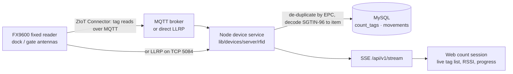
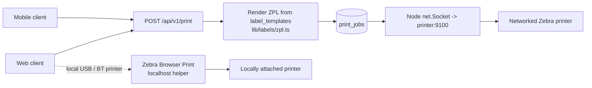

# Zebra Device Integration

> How both clients talk to Zebra hardware: Bluetooth and ring scanners, RFID readers, and label printers.
> The web app and the mobile app share one device _abstraction_ and one device _registry_, but reach the
> hardware by different routes, because a browser and a native Android app have very different capabilities.
>
> **We have no Zebra hardware today.** Sections 11 and 12 describe how the connectors are nevertheless built,
> tested and made ready, so that the arrival of devices is a day of configuration rather than a phase of
> development.
>
> Architecture: [ARCHITECTURE.md](ARCHITECTURE.md) §7 · Plan: [PROJECT_PLAN.md](PROJECT_PLAN.md) Phase 5 ·
> Demo mode: [DEMO_MODE.md](DEMO_MODE.md)

---

## 1. The honest constraint

A native app can open a Bluetooth socket, load a vendor SDK and talk to anything. **A browser cannot.** It has
no raw TCP sockets, no Bluetooth Classic / SPP, no vendor SDKs, and its device APIs are Chromium-only and
require HTTPS plus an explicit user gesture.

So the web device layer is built in **four tiers**, from "works everywhere with no installation" to "richest
capability". Every workflow must function on Tier 1. Everything above it is progressive enhancement, chosen
automatically from what the browser and the site actually have.

| Tier  | Route                           | Works in                       | Install needed                | What you get                                                    |
| ----- | ------------------------------- | ------------------------------ | ----------------------------- | --------------------------------------------------------------- |
| **1** | **HID keyboard wedge**          | Every browser, every OS        | None                          | Barcode data from any paired scanner. The universal floor.      |
| **2** | **WebHID / Web Bluetooth**      | Chromium (Chrome, Edge, Opera) | None                          | Symbology, battery, beeper and LED control, no focus stealing   |
| **3** | **Zebra Browser Print**         | Chromium + Firefox             | Small Zebra utility on the PC | Locally attached USB / Bluetooth Zebra printers, with status    |
| **4** | **Server-side device services** | Any browser                    | None on the client            | Networked printers (TCP 9100), fixed RFID readers (LLRP / MQTT) |

**Design rule:** the app never _requires_ a tier. It detects what is available, reports it on the Devices
screen, and falls back silently. A user on Safari with a Bluetooth ring scanner and a networked printer gets a
fully working system on Tiers 1 and 4.

---

## 2. Hardware in scope

Zebra's families that make sense for this system. Final model selection is Q6 in ARCHITECTURE §12 — this is the
set the design must accommodate, and the connectors are built for all of it before any of it arrives (§11).

### Scanners

| Class                          | Models                               | Web                                                    | Mobile                          |
| ------------------------------ | ------------------------------------ | ------------------------------------------------------ | ------------------------------- |
| **Bluetooth ring scanners**    | RS5100, RS6000, RS5000 (corded ring) | Tier 1 (HID) · Tier 2 (WebHID)                         | Zebra Scanner SDK, full control |
| **Wearable scanner-computer**  | WS50                                 | Runs the web app in its own browser, or the mobile app | Runs the mobile app directly    |
| **Handheld / cordless**        | DS2278, DS3608, DS3678, LI3678       | Tier 1 · Tier 2 · USB cradle                           | HID or SDK                      |
| **Presentation / fixed-mount** | DS9908, MP7000                       | Tier 1 · Tier 2 (desk workstations)                    | n/a                             |

All of these can present as an **HID keyboard**, which is why Tier 1 is a real floor and not a compromise.

### RFID

| Class                     | Models                       | Owner                                                        |
| ------------------------- | ---------------------------- | ------------------------------------------------------------ |
| **Handheld sleds**        | RFD40 / RFD90 (UHF), RFD8500 | **Mobile app.** They clip onto a phone; that is their design |
| **RFID mobile computers** | MC3300R, MC3390R             | **Mobile app**                                               |
| **Fixed readers**         | FX9600, FX7500               | **Web app**, via the server (§5)                             |
| **Overhead locationing**  | ATR7000                      | Web app, phase 2 — real-time location, not in v1             |

### Printers

| Class                  | Models                             | Route                                                |
| ---------------------- | ---------------------------------- | ---------------------------------------------------- |
| **Desktop**            | ZD421, ZD621, ZD621R (RFID)        | Networked → server TCP 9100. USB → Browser Print     |
| **Industrial**         | ZT411, ZT421, ZT610, RFID variants | Networked → server TCP 9100                          |
| **Mobile / belt-worn** | ZQ511, ZQ630, ZQ630 Plus           | Bluetooth → mobile app (Link-OS). Networked → server |
| **Print engines**      | ZE511                              | Networked → server                                   |

### Mobile computers (run the apps)

TC22 / TC27, TC52 / TC53, TC58, TC73 / TC78, WT6300 wearable, ET40 / ET45 tablets. These run either the
Kotlin mobile app or the web app in Chrome — and on the latter, **DataWedge keystroke output feeds Tier 1**, so
the web app scans correctly on a Zebra handheld with no code changes.

### Zebra software this design relies on

|                         | What it is                                                                | Used for                                                                   |
| ----------------------- | ------------------------------------------------------------------------- | -------------------------------------------------------------------------- |
| **DataWedge**           | Scan middleware on Zebra Android devices                                  | Feeds scans into the web app as keystrokes; feeds the mobile app by intent |
| **Browser Print**       | Small Zebra desktop utility exposing local printers over localhost        | Tier 3 printing from the browser                                           |
| **Link-OS SDK**         | Printer SDK (Android / iOS / Java)                                        | Mobile-app printing, printer status, firmware                              |
| **RFID & Scanner SDKs** | Android / iOS device SDKs                                                 | Mobile-app scanner and sled control                                        |
| **ZIoT Connector**      | Fixed-reader firmware that publishes tag reads to MQTT / HTTP / WebSocket | Server-side fixed RFID (§5)                                                |
| **StageNow / MDM**      | Device provisioning                                                       | Fleet rollout, DataWedge profiles, app deployment                          |

---

## 3. Tier 1 — HID keyboard wedge (the universal floor)

Every Zebra Bluetooth scanner, ring scanner included, can pair to a PC, tablet or phone as a Bluetooth
**keyboard**. It types the barcode and sends a terminator (Enter or Tab). No driver, no SDK, no permission
prompt, no browser restriction.

The web shell mounts a global `<ScanProvider>` that distinguishes a scan from human typing:

```
keystrokes arriving < ~30 ms apart, ≥ 4 characters, ending in Enter/Tab  ->  a scan
anything slower                                                           ->  a person typing
```

The buffered value is routed to whatever screen is active — scan-anywhere, a count session, a movement form's
item field — and is suppressed from the focused input so it never lands in a search box by accident. A visible
indicator confirms the listener is armed, because silent failure here is maddening on a warehouse floor.

**Limits, stated plainly:** no symbology, no battery level, no beeper or LED control, no way to tell two
scanners apart, and the scanner needs to be paired at the OS level. That is exactly what Tier 2 fixes.

**Configuration:** Zebra's 123Scan utility or a configuration barcode sets HID mode, the terminator and the
inter-character delay. A one-page "scanner setup" sheet ships with the deployment runbook.

---

## 4. Tier 2 — WebHID and Web Bluetooth (Chromium)

Where the browser supports it, the app claims the scanner directly instead of listening for keystrokes.

| API               | Browsers                                | Requires                                | Gives us                                                                                   |
| ----------------- | --------------------------------------- | --------------------------------------- | ------------------------------------------------------------------------------------------ |
| **WebHID**        | Chrome, Edge, Opera — **desktop only**  | HTTPS + user gesture to pair            | Raw HID reports: barcode data _and_ symbology, no focus dependency, no keystroke injection |
| **Web Bluetooth** | Chrome, Edge, Opera (desktop + Android) | HTTPS + user gesture; **BLE GATT only** | Battery level, connection state, and control of devices exposing BLE GATT services         |

Neither is available in Safari or Firefox. Web Bluetooth cannot reach Bluetooth Classic / SPP, which is what
several Zebra scanners use for their SDK protocols — so **Web Bluetooth is treated as opportunistic**, useful
for battery and status where a model supports BLE, never as the primary scan path.

Practical stance: implement **WebHID as the primary Tier 2** now, tested against synthetic HID reports (§11.1),
verify per model when hardware arrives, and fall back to Tier 1 whenever the pairing is not granted or the
device is not recognised — which means a disappointing model costs nothing but capability. Pairing
is remembered per browser profile, so the user grants it once per workstation.

---

## 5. RFID on the web — fixed readers through the server

A browser cannot speak LLRP, and handheld sleds are designed to attach to a phone. So the split is:

- **Handheld RFID (RFD40 / RFD90, MC3300R):** the mobile app, using the Zebra RFID SDK. Already designed and
  simulated in the mobile repo.
- **Fixed RFID (FX9600 / FX7500):** the **server**, streamed to the browser.



The service de-duplicates by EPC within a session window, decodes each EPC to an item using the existing
`Sgtin96.decode()` logic ported from Kotlin, writes raw reads to `count_tags` for audit, and streams progress to
the browser over SSE. The count itself then goes through **exactly the same** `SubmitCycleCount` domain code as
a count taken on a phone — the reader is just a different source of tag reads.

**Use cases this unlocks that a handheld cannot:** automatic receiving as pallets pass a dock portal,
unattended dispatch verification, and continuous zone-level stock visibility.

---

## 6. Printing

Browsers cannot open raw TCP sockets, so **printing is a server service by default** (WADR-014).



| Path                            | When                                                    | Notes                                                                                                                   |
| ------------------------------- | ------------------------------------------------------- | ----------------------------------------------------------------------------------------------------------------------- |
| **Server TCP 9100** _(default)_ | Networked printers anywhere on the warehouse LAN        | No client install. One queue and one history for both clients. The server must be able to route to the printer          |
| **Zebra Browser Print**         | A printer attached by USB or Bluetooth to a specific PC | Requires the Zebra utility installed on that PC. Detected at runtime; the printer appears in the picker only if present |
| **Link-OS SDK**                 | Belt-worn ZQ printers paired to a phone                 | Mobile app only                                                                                                         |
| **Simulated**                   | Development, demos, CI                                  | Mirrors the mobile app's simulated printer: accepts ZPL, returns "Printed", shows a preview                             |

**Templates live in the database** (`label_templates`), not in code. Today the mobile app hard-codes ZPL in
Kotlin; that becomes a template row rendered by `lib/labels/zpl.ts` and pulled by both clients. A label can be
changed without an app release — which matters, because label formats change more often than software does.

**Label preview** is rendered in the browser from the same template (EAN-13 barcode drawing already exists in
the mobile app's `Ean13.kt` and is ported), so what you see is what prints.

**RFID encode-on-print:** RFID-capable printers (ZD621R, ZT411 RFID) encode the tag and print the label in one
pass via `^RFW` in the ZPL. The EPC comes from the server's serial-block allocation (ARCHITECTURE §5.5), and the
encoded EPC is written to `print_jobs`, so every physical tag is traceable to its item, operator and moment.

**A limit worth stating, found while building the connector:** a printer that drops the connection part way
through a job is only detectable when the job is large enough that we are still writing when the reset arrives.
A small job is handed to the kernel in one segment, so a mid-job drop is indistinguishable from a clean close.
This is a property of TCP 9100, not something the connector can paper over — and it is the reason a successful
`print()` reports `SENT` rather than `CONFIRMED`, and why reprinting a label must always be one click away.

**Print status:** TCP 9100 is fire-and-forget by nature. Status (paper out, head open, paused) is read back over
the printer's SGD / status channel where the model supports it, otherwise jobs are marked `SENT` rather than
`CONFIRMED` and the Devices screen says so honestly rather than implying a confirmation we do not have.

---

## 7. The device registry

One `devices` table, shared by both clients. It answers the questions a warehouse manager actually asks: what
hardware do we have, where is it, who has it, is it working, and which device recorded this movement?

- Printers and fixed readers are registered by an **admin** with a network address, and are usable by everyone.
- Scanners and mobile computers **self-register** on first connection and bind to a user.
- Every movement carries `device_id`, so the ledger answers "which scanner recorded this?"
- Every print carries `printer_device_id`.
- `last_seen_at` drives the stale-device exception list.
- A **live event console** — the mobile MVP already has one — mirrors on the web over SSE: connections, scans,
  trigger presses, tag reads, print jobs and errors, as they happen. It is the fastest way to tell a working
  setup from a broken one during a rollout.

---

## 8. Simulation

The mobile MVP ships simulators for all three device types, driven by a `SimulatedWarehouse` model where every
unit on hand carries a real SGTIN-96 EPC (its ADR-011). **The web app does the same**, and for the same reasons:
every workflow is demoable and testable in CI without hardware, and development is not blocked waiting for
devices to arrive.

Simulated devices are labelled **"Simulation"** in the UI, exactly as on mobile. That transparency is a
deliberate choice, and it is also what makes the simulators safe to leave enabled in staging.

---

## 9. Rollout considerations

| Concern                        | Note                                                                                                                                                              |
| ------------------------------ | ----------------------------------------------------------------------------------------------------------------------------------------------------------------- |
| **HTTPS is mandatory**         | WebHID, Web Bluetooth and Browser Print all require a secure context. A valid certificate is a prerequisite, not a nicety — including on an on-premise deployment |
| **Network reachability**       | The server must route to printers (TCP 9100) and fixed readers (LLRP 5084 / MQTT). On-premise or VPN. Confirm before Phase 4 — this is Q7                         |
| **Browser choice**             | Chrome or Edge on warehouse workstations unlocks Tier 2. Not required, but recommended in the runbook                                                             |
| **Scanner provisioning**       | 123Scan or configuration barcodes for HID mode and terminator; StageNow or MDM for DataWedge profiles on Zebra Android devices                                    |
| **Pairing is per workstation** | WebHID and Browser Print permissions are per browser profile. Shared workstations need a shared profile or a one-time setup per user                              |
| **Firmware**                   | Note the firmware of each model during Phase 4 testing. Zebra behaviour varies by firmware, and "it worked on the demo unit" is a real failure mode               |

---

## 10. What has to be validated on real hardware

Simulators prove the flows. They do not prove the integration. The following are explicitly **unverified until
tested on the client's own devices**, and Phase 5 of the plan reserves time for it:

1. Each ring scanner model in HID mode: terminator behaviour, inter-character timing, and whether the Tier 1
   detection heuristic holds.
2. WebHID report formats per scanner model — these differ, and some need a per-model parser.
3. Whether the chosen printers accept ZPL on 9100 with the site's network configuration, and what their status
   channel actually returns.
4. RFID encode-on-print on the specific RFID printer model, including tag placement and write power.
5. Fixed-reader integration: LLRP directly versus ZIoT Connector over MQTT, antenna configuration, read zones,
   and how much stray-tag filtering the environment needs.
6. Zebra Browser Print on the actual workstation OS and browser build.

The device abstraction exists precisely so that discoveries here change one adapter, not the application.

---

## 11. Building connectors without hardware

We have no Zebra devices. The connectors are still built, in full, during Phase 5 — because the goal is that
plugging in a device is a configuration task, not a development task.

The method is simple to state and is what makes the claim credible: **every adapter is written against the real
protocol and tested against something that actually speaks that protocol.** Not against a mock object. A
connector verified against a mock proves only that we can write a mock.

### 11.1 The four protocol-level test doubles

| Connector                     | Test double                                                                                                                               | What it proves                                                                                                                                                     |
| ----------------------------- | ----------------------------------------------------------------------------------------------------------------------------------------- | ------------------------------------------------------------------------------------------------------------------------------------------------------------------ |
| **Printer (TCP 9100)**        | A Node TCP server on port 9100 that accepts the connection, reads the byte stream, and asserts on the ZPL received                        | The socket lifecycle, timeouts, retries, partial writes, connection loss mid-job, and the exact bytes a printer would receive                                      |
| **Printer (ZPL correctness)** | A **ZPL renderer** in CI (Labelary or a self-hosted equivalent) that turns our ZPL into an image                                          | That the label actually renders: field placement, barcode validity, sizing at 203 and 300 dpi. A label that renders wrong is the most likely hardware-day surprise |
| **Fixed RFID (LLRP)**         | An LLRP server double that completes the connection handshake and emits `RO_ACCESS_REPORT` messages with EPC, RSSI, antenna and timestamp | Message framing, reader configuration, the tag-report path, reconnect on drop                                                                                      |
| **Fixed RFID (ZIoT / MQTT)**  | A local MQTT broker (Mosquitto in CI) publishing recorded-shape Zebra IoT Connector payloads                                              | Subscription, payload parsing, de-duplication, back-pressure under a heavy tag stream                                                                              |
| **Scanner (WebHID)**          | Synthetic HID input reports built from published report descriptors, fed to the parser                                                    | Report parsing per model family, symbology decoding, partial and split reports                                                                                     |
| **Scanner (keyboard wedge)**  | Synthetic keystroke sequences at realistic and adversarial timings                                                                        | The scan-versus-typing heuristic, terminator handling, focus suppression, split reads                                                                              |

These run in CI on every push. A connector that passes them is not _proven_ to work with a given device, but
every failure mode it can be tested for without hardware has been tested.

### 11.2 What genuinely cannot be tested without devices

Stated plainly, so nobody is surprised on hardware day:

- Bluetooth pairing behaviour and reconnection of a specific scanner model.
- Real HID report descriptors — published ones are a good guide, not a guarantee.
- Printer firmware quirks, status-channel behaviour, and darkness or media calibration.
- RFID read range, antenna tuning, stray-tag volume, and write power for encode-on-print.
- Whether a specific reader is happier on LLRP or ZIoT in the site's network.
- Zebra Browser Print on the actual workstation OS and browser build.

The tiered design (§1) is the insurance: **no single device is load-bearing.** If a scanner's WebHID path
disappoints, Tier 1 keyboard wedge still runs every workflow. If a printer is unreachable, the job queues.

### 11.3 The connector self-test

Every adapter implements a `selfTest()` that the Devices screen can run on demand and that the bring-up
checklist uses:

```
Printer   : resolve host -> open socket -> ~HS status query -> print a test label -> confirm
RFID      : connect -> read capabilities -> configure antenna -> 5-second inventory -> tag count
Scanner   : claim device -> await one scan -> report data, symbology, latency
```

It reports what actually happened at each step, not a boolean. On hardware day, `selfTest()` is the first thing
run against each device, and its output is the bring-up record.

---

## 12. Hardware bring-up checklist

When devices arrive, this is the sequence. It should be a day, not a sprint.

**Before the hardware arrives**

- [ ] Confirm the models being supplied and their firmware versions (Q6)
- [ ] Confirm network topology: can the server reach printers on 9100 and readers on 5084 / MQTT? (Q7)
- [ ] Label stock ordered and confirmed against template dimensions, including RFID stock if encoding
- [ ] Workstation browsers agreed — Chromium unlocks Tier 2, but is not required
- [ ] HTTPS certificate in place — mandatory for WebHID, Web Bluetooth and Browser Print

**Printer**

- [ ] Assign a static IP or DHCP reservation; register the device in the registry
- [ ] Run `selfTest()`; confirm the test label prints
- [ ] Calibrate media; check darkness and print speed against the label stock
- [ ] Compare a printed label to the CI-rendered image — they should match
- [ ] RFID printers: confirm `^RFW` encoding, tag placement and write power; verify the encoded EPC reads back

**Scanner / ring scanner**

- [ ] Configure HID mode, terminator and inter-character delay via 123Scan or a configuration barcode
- [ ] Pair to a workstation; verify Tier 1 capture on the scan screen
- [ ] Attempt the WebHID pairing; record the report format for that model; fall back cleanly if it disappoints
- [ ] Verify piece and case barcodes resolve to the right item and pack size
- [ ] Run a full receive from a scan, end to end

**RFID reader**

- [ ] Handheld sled: pair to the phone, run the mobile app's device screen
- [ ] Fixed reader: choose LLRP or ZIoT, configure antennas and read zones
- [ ] Run a controlled read of a known set of tags; measure the false-negative and stray-tag rate
- [ ] Tune transmit power and any filtering; record the settings in the device registry
- [ ] Run a full cycle count against a location with a known planted variance

**Sign-off**

- [ ] Every `selfTest()` output recorded against its device
- [ ] One full workflow per device type, executed on real hardware in Live mode
- [ ] Firmware versions recorded in the device registry
- [ ] Scanner and printer setup sheets updated with the settings that actually worked
